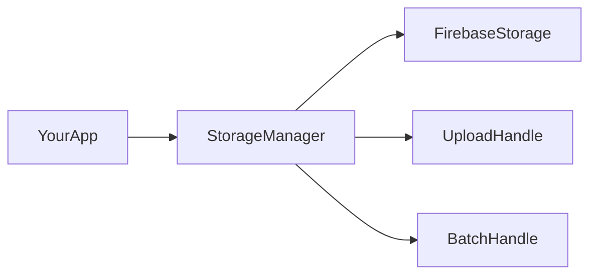

**firebase-storage-kit** wraps Firebase Storage uploads for browser apps. If you already use Firebase and want resumable uploads with progress events, pause/resume/cancel, automatic retries, and batch uploads — without wiring `uploadBytesResumable` yourself — this library is for you.

## What you get

- **Single and batch uploads** with concurrency control
- **Progress events** on each file and on the whole batch
- **Pause, resume, and cancel** during an upload
- **Automatic retries** with exponential backoff for transient errors
- **Pre-upload validation** — size, MIME type, extension, and image dimensions
- **File helpers** — `exists`, `getMetadata`, `getDownloadURL`, `delete`
- **Global state** — subscribe once to see every active upload

## How it fits in your app



1. You initialize Firebase and pass a `FirebaseStorage` instance to `StorageManager`.
2. You call `uploadFile` or `uploadFiles` and listen with `.on(...)`.
3. The manager talks to Firebase under the hood and keeps upload state in sync.

## Quick example

```ts
import { getStorage } from "firebase/storage";
import { StorageManager } from "firebase-storage-kit";

const manager = new StorageManager(getStorage(app));

const handle = manager.uploadFile(file, { path: `uploads/${file.name}` });

handle.on("progress", (upload) => {
  console.log(`${Math.round(upload.progress * 100)}%`);
});

handle.on("success", (upload) => {
  console.log(upload.downloadURL);
});
```

## Where to go next

<Cards>
  <Card title="What you need" href="/docs/getting-started/prerequisites">
    Firebase project, Storage rules, and peer dependencies.
  </Card>
  <Card title="Single upload" href="/docs/getting-started/single-upload">
    Step-by-step single-file upload with progress.
  </Card>
  <Card title="Batch uploads" href="/docs/guides/batch-uploads">
    Upload many files at once with concurrency.
  </Card>
  <Card title="Validation" href="/docs/guides/validation">
    Reject files by size, type, or image dimensions before upload.
  </Card>
</Cards>
